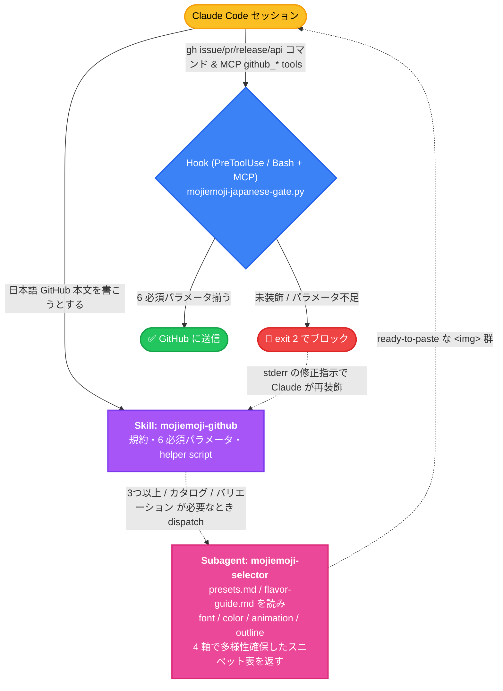

# mojiemoji-plugin

<p align="center">
  
</p>

[](LICENSE) [](https://docs.claude.com/en/docs/claude-code/plugins) [](https://mojiemoji.jozo.beer) [](https://github.com/jozobeer/mojiemoji-plugin/releases) [](https://codecov.io/gh/jozobeer/mojiemoji-plugin) [](https://github.com/jozobeer/mojiemoji-plugin/commits/main) [](https://github.com/jozobeer/mojiemoji-plugin/stargazers) [](https://mojiemoji.jozo.beer)

[**mojiemoji.jozo.beer**](https://mojiemoji.jozo.beer) のスタンプ画像で日本語の GitHub Markdown (issue / PR / レビュー / リプライ / リリースノート) を  に — `これは【マジで】やばい【バグ】ですね` のように **キーワードだけスタンプ化** する mid-sentence インライン強調を **自動で適切に埋め込む** Claude Code  🚀

 的にはこの README 自体が dogfooding なので、上から下までスタンプまみれ ✨

---

## 🎭 ビフォー・アフター

プレーンな日本語 PR コメント:

> これはマジでやばいバグですね。緊急で修正お願いします。LGTM したら歓迎です。

mojiemoji-plugin が掛かった世界:

> これはやばいですね。でお願いします。したらです。

同じ文章 / 同じ情報量、印象は完全に別物。プラグインが面倒な装飾作業を全部やる 🎨

> [!NOTE]
> この README 全体が dogfooding を兼ねるスタンプ装飾済み本文で、各スタンプは文中の単語そのものを **置換** する形で配置されています。`keyword<stamp:keyword>` のような隣接装飾は使っていません — 同じ単語が 2 回読まれて視覚的に冗長になるためです。スタンプ画像がレンダされない環境では、その単語位置だけ空白に見える点に留意してください。

---

## 📦 同梱されるもの

3 層構造で  されています。

| 種別 | 名前 | 役割 |
|---|---|---|
| Skill | `mojiemoji-github` | GitHub の各 surface (issue / PR / レビュー等) ごとのスタンプ配置ポリシー、6 必須パラメータ規約、helper script を提供 |
| Subagent | `mojiemoji-selector` | フレーズ群を受け取り、フォント / 色 / アニメーション / アウトラインを多様性確保しつつ選定して `` スニペットを返す |
| Scripts | `prestamp.py` / `coverage.py` | `prestamp.py` は高頻度語を決定論的に先置換(variant 抽選 + safe-zone 保護)、`coverage.py` は stamp 密度 / sentence hit rate / 段落偏りを計測し閾値未満を warn または block |
| Hook (PreToolUse / Bash + MCP) | `mojiemoji-japanese-gate.py` | 日本語本文を投稿しようとした時、6 必須パラメータ揃わない mojiemoji URL を含むコマンドを **送信前にブロック**。対象は `gh (issue\|pr\|release) (create\|comment\|review\|edit)` / `gh api .../reviews\|comments\|issues\|releases` (Bash 経路) と、`mcp__*__github_*` (MCP 経路、`github_create_pull_request` / `github_add_issue_comment` / `github_pull_request_review_write` 等の `body` / `description` フィールド) の両方 |

---

## 🚀 インストール

### マーケットプレイス追加 + インストール (推奨)

Claude Code 内で:

```
/plugin marketplace add jozobeer/mojiemoji-plugin
/plugin install mojiemoji-github@mojiemoji-plugin
```

これで  🎉

### ローカルチェックアウトから

```bash
git clone https://github.com/jozobeer/mojiemoji-plugin.git ~/mojiemoji-plugin
```

Claude Code 内で:

```
/plugin marketplace add ~/mojiemoji-plugin
/plugin install mojiemoji-github@mojiemoji-plugin
```

### 動作確認

インストール後、Claude Code に日本語 issue を作るよう依頼してみてください。フック (`mojiemoji-japanese-gate.py`) が `gh issue create` を一旦止めて、本文を mojiemoji 装飾した上で送信し直すはずです。

```
/plugin
```

で `mojiemoji-github` が `enabled` になっていれば  🎊

---

## 🏗️ 仕組み — 3 層構造



緊急 bypass: `MOJIEMOJI_HOOK_DISABLED=1` を含めると Hook がスキップされる（推奨しない、ダークモードで  のまま投稿される）。Bash 経路はコマンドの先頭、MCP 経路は `body` 内のどこかに含めれば良い。詳細は § 環境変数。

---

## ❓ なぜこのプラグインが必要か

mojiemoji の画像 URL を生で組み立てると、**色だけで dark mode 不可視になる ** + **他パラメータ欠落で読めないスタンプを  する** という事故が起こる:

| パラメータ | 必須値 | 欠落時の影響 | 致命度 |
|---|---|---|:---:|
| `color` | 明るめの hex (例: `#a855f7` / `#22c55e` — Tailwind パレットの 300〜500 帯が目安として便利) または `vivid-blue` 等のサービスプリセット名。**サービスは Tailwind クラス名は受け付けない**、hex か名前付きプリセットのみ | サービスデフォルトが黒 → **dark mode で完全不可視** | 💀 致命 |
| `background` | `transparent` | dark mode で白ブロックが本文を切り裂く | ⚠️ 大 |
| `animation` | 34 種の正準アニメから選ぶ。rotational 系 (`kaiten` / `kage_kaiten`) は **`speed=step` または `slow` の時のみ可読** — `normal` / `fast` / 省略 (デフォルト fast) は回転が早すぎて読めない streak になる (hook で reject、helper は速度未指定なら自動で `slow` を注入) | 欠落時は静止画 → スタンプとしての視覚的 punch が消える | ⚠️ 中 |
| `font` | 17 種の正準フォント | サービスデフォルトの素フォント → body 高さで読みづらい | ⚠️ 中 |
| `outline` | `triadic` 推奨 / `complement` / `darker` / `lighter` / 6-hex | 字形が背景と融合してぼやける | ⚠️ 中 |
| `outline_width` | `2` | 1px は線が細すぎ、3px+ は字形が潰れる | 💡 小 |

特に `color` 欠落 → dark mode 黒不可視は **3 回ユーザにフラグされた  事例**（直近: cross-repo-review 2026-05-12 で 7 レビュー分のスタンプが全部見えない状態で投稿された 💣）。LLM が手書きで URL を組み立てると `background=transparent` だけ付けて他を忘れる事故が頻発する。このプラグインは:

1. **Skill** で 6 必須パラメータをドキュメント化
2. **Subagent** に丸投げして手書きを回避
3. **Hook** で「もし手書きで送信しようとしたら止める」 last-mile gate を実装

の 3 段で防ぐ 🛡️

---

## 🎯 スコープ — plugin 単独で再現される範囲

このプラグインは **mojiemoji 装飾そのもの** を 1 つの SSOT に集約することを目的としている。「`/plugin install` するだけで装飾規約が動く」状態を保証するため、user-global config への依存を作らない設計。

### ✓ Plugin 単独で再現されるもの

- ** surface の完全列挙** — `gh issue/pr/release create` / raw `gh api .../reviews` / MCP GitHub ツール / subagent 駆動の一括投稿、いずれの経路でも日本語 body 投稿前に gate が発火する(SKILL.md § Hard pre-action gate)
- ** ポリシー** — inline-saturation default / surface 別の badge + stamp ルール / LGTM は他スタンプと同等(mojiemoji 単独なら自由、他 LGTM-imagery skill 併用時のみ mojiemoji は inline 推奨) / do-not-stamp リスト(API 名 / file path / 識別子)
- **URL canonical 仕様** — 通常は 6 必須パラメータ(font / color / animation / background / outline / outline_width)、rotational アニメは追加で speed 必須、`disco` / `psycho` / `kira` 等の color-shifting アニメは outline 系を省略する (4 パラメータ運用)、ダークモード対応 hex 帯
- **PreToolUse hook** — 未装飾 body の submission を block(`gh` / raw `gh api` / MCP / subagent 経由すべて)
- **mojiemoji-selector subagent** — 複数フレーズ・カタログ生成・配置判断のデリゲート先
- **helper script** (`${CLAUDE_PLUGIN_ROOT}/skills/mojiemoji-github/scripts/mojiemoji_markdown.py`) — 単一フレーズのファストパス

### ✗ Plugin 単独では再現されないもの(別 SSOT)

以下は **user-personal な workflow skills/agents** であり、本プラグインの責務範囲外:

- `make-issue` / `make-pr` / `address-review` / `triage-review` / `cross-repo-review` / `vibes-review` / `copilot-review` / `good-morning` 等の review/issue/PR ワークフロー skills
- `pr-reviewer` / `review-responder` 等のレビュー特化 subagents
- LGTM 画像生成系の skill(本プラグインは mojiemoji LGTM の使用自体は何ら制限しない。別の LGTM-imagery skill を併用するときに「mojiemoji の block-image を重ねない」という編集ガイドラインを SKILL.md で示すだけで、その別 skill の存在は user 環境依存)

これらのスキルが mojiemoji を使う場合、本プラグインの skill / hook を呼ぶ形で integration するのが正しい設計。逆方向(plugin が user-personal skill を仮定する)は依存方向として禁止。

### 設計原則: plugin-agnostic な user-global

本プラグインを採用するなら、user-global config(`~/.config/claude/CLAUDE.md` / `rules/*` / `agents/*`)から「mojiemoji」言及を削除して構わない。すべての routing は plugin の `when_to_use` トリガーと hook の発火で完結する。これで user 環境と fresh-install 環境が対称になる。

### 唯一の例外: subagent frontmatter

Claude Code の subagent (`~/.config/claude/agents/*.md` や同梱の `mojiemoji-selector` 以外のユーザー作成 agent) は **skill 隔離** されており、メインスレッドのように skill を auto-discover しない。subagent から `Skill` ツールで `mojiemoji-github` を呼びたい場合、subagent の frontmatter で skill を明示宣言する必要がある:

```yaml
---
name: my-review-subagent
model: sonnet
skills:
  - mojiemoji-github   # ← 明示宣言が必要
---
```

これは harness 側の仕様で plugin から bypass できない。宣言しない場合の挙動は以下:

- subagent が日本語 GH body を投稿しようとする → PreToolUse hook が block
- hook の error message に **helper script 直接実行手順** が含まれる(`scripts/mojiemoji_markdown.py` を直接呼ぶ recovery 経路)ので、subagent は skill access 無しでも復帰可能
- ただし装飾品質は skill 経由より粗くなる(単一フレーズ × ファストパスの組み合わせ)

つまり「品質を保ちたい subagent は frontmatter に skill 宣言」、「最低限通したいだけなら宣言不要(hook の自己完結 recovery で通る)」の 2 段構成。

---

## ⚙️ 設定

### 環境変数

このプラグインが認識する変数の一覧。

#### プラグイン固有(`MOJIEMOJI_*`)

| 変数 | 用途 | 例 |
|---|---|---|
| `MOJIEMOJI_HOOK_DISABLED` | `1` にすると PreToolUse hook を 1 投稿分だけ素通しさせる緊急 bypass。Bash なら command 先頭、MCP なら `body` 中のどこかに含める | `MOJIEMOJI_HOOK_DISABLED=1 gh issue create ...` |
| `MOJIEMOJI_CACHE_FILE` | 使用ログ (`usage.jsonl`) の保存先を上書き | `MOJIEMOJI_CACHE_FILE=/tmp/mojiemoji.jsonl` |
| `MOJIEMOJI_CACHE_DISABLED` | `1` / `true` / `yes` にすると `cache_record.py` が静かに no-op になる(オプトアウト) | `MOJIEMOJI_CACHE_DISABLED=1` |

MCP 経路で `MOJIEMOJI_HOOK_DISABLED=1` を使う場合、`body` テキストならコメントや脚注に紛れさせても hook が走査するので効く。乱用は厳禁 — 1 投稿 1 bypass の最小スコープで使うこと(hook が騒いだ箇所はだいたい本物の問題である)。

> [!NOTE]
> `MOJIEMOJI_HOOK_DISABLED` の旧名 `HOOK_DISABLE` も当面は動くが、検出時に stderr に deprecation warning を出力する。将来のリリースで削除予定なので新名へ移行してほしい。`MOJIEMOJI_*` 接頭辞に揃える方針 ([#50](https://github.com/jozobeer/mojiemoji-plugin/issues/50))。

#### 参照する外部変数

| 変数 | 用途 |
|---|---|
| `XDG_DATA_HOME` | `MOJIEMOJI_CACHE_FILE` 未設定時のデフォルト保存先 `${XDG_DATA_HOME:-$HOME/.local/share}/mojiemoji-plugin/usage.jsonl` の起点 |
| `CLAUDE_PLUGIN_ROOT` | Claude Code が hook / skill 起動時に注入する、プラグインの展開先絶対パス。`hooks/hooks.json` や SKILL.md の引数で `${CLAUDE_PLUGIN_ROOT}/...` として参照 |
| `SKILL_DIR` | `mojiemoji-github` skill が `mojiemoji-selector` subagent をディスパッチする際に渡す、skill 本体ディレクトリの絶対パス。subagent が references を読み解けるようにするための明示渡し |

### Hook 自体を無効化したい

Claude Code の `/plugin` メニューで disable するか、`hooks/hooks.json` を 。

### Skill / Subagent のカスタマイズ

`skills/mojiemoji-github/references/presets.md` でフォント / 色 / アニメの preset 群を編集できます。

---

## 🔗 関連リンク

- mojiemoji 本体サービス: https://mojiemoji.jozo.beer
- Claude Code プラグインドキュメント: https://docs.claude.com/en/docs/claude-code/plugins
- agent-browser (参考にしたプラグインマーケットプレイス構成): https://github.com/vercel-labs/agent-browser

---

## 📄 License

[MIT](LICENSE) — `jozobeer`

---

<p align="center">
  <sub>Made with  for Japanese GitHub.</sub>
</p>
